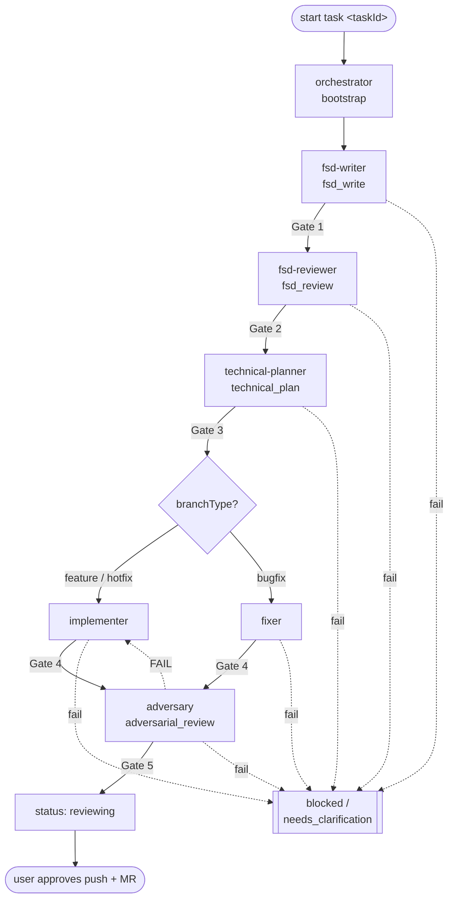

# Agents — Role registry, workflow, gates (the single source of truth for the lifecycle)

> **Scope:** the canonical document defining the 7 roles, the lifecycle through gated stages, how the implementer is chosen from `branchType`, and the skip rules. Detailed operating rules (MCP, guardrails, branches, handoff, commands, token budget): [`agents/SharedRules.md`](./agents/SharedRules.md) — not repeated here.
> **Repos:** declared in `harness.config.json → repos`. The harness runs in three layouts — see §0.

---

## 0. Repo layouts

The harness makes no assumption about where the code lives. `harness.config.json → repos` declares each repo an agent may edit, with `path` relative to the directory holding the config:

| Layout | `repos` | Task docs live | Worktree |
| --- | --- | --- | --- |
| **A. Inside the code repo** (one FE repo, or one BE repo) | `[{ name, path: ".", layer }]` | in the **same repo** as the code | `/start-task` creates a worktree of that repo; task docs travel with it |
| **B. Inside one repo, reading sibling repos** | `[{ path: "." }, { path: "../<repo>", … }]` | in the main repo | as in A; sibling repos are **read-only**, no worktree, no edits |
| **C. Alongside FE + BE** (the harness is its own repo) | `[{ path: "../fe" }, { path: "../be" }]` | in the **harness repo**, separate from every code repo | the worktree is created **inside the code repo** being edited (the task's `repoName`); task docs stay in the harness repo and do **not** enter the worktree |

**Rules common to all three:**

- `repoName` in `task.agent.json` names exactly one `repos` entry — the repo the agent may edit. A wrong name is blocked by the validator.
- A repo declared in `repos` that is **not** the task's `repoName` is **read-only** (e.g. reading BE DTOs — [`agents/TechnicalPlanner.md` §3.2](./agents/TechnicalPlanner.md)). Readable, not editable.
- A repo **not** declared in `repos`: do not touch it at all.
- A subagent **never** creates or switches worktrees — it is already in the right place when dispatched ([`Instructions.md` §1](./Instructions.md)).
- Layout C: committing task docs and committing code are **two different repos**, two commits. Once the gates pass → `reviewing` → the user decides what to commit where.

A task touching **several layers** (e.g. changing both FE and BE): split it into two tasks, one `repoName` each. A `task.agent.json` holds exactly one `repoName` — forcing two repos into one task makes AC traceability and Gate 3 scope meaningless.

---

## 1. Role table (7 roles)

Names are kebab-case; the task's `layer` comes from `repos[].layer`; each role has a file in [`agents/`](./agents/SharedRules.md).

| Role | Stage | Main output | Gate blocks when | Detail |
| --- | --- | --- | --- | --- |
| `orchestrator` | bootstrap | the task folder, `task.agent.json`, `00-Metadata.md`, `.agent-memory/` | required metadata is missing and cannot be inferred | [`agents/Orchestrator.md`](./agents/Orchestrator.md) |
| `fsd-writer` | fsd_write | `01-FSD.md` (a task-level IEEE FSD — skill `document-to-ieee-srs`) | the FSD is incomplete / untraceable (**Gate 1**) | [`agents/FSDWriter.md`](./agents/FSDWriter.md) |
| `fsd-reviewer` | fsd_review | `02-FSD-Review.md` (ACs, BA questions, risks) | intent / ACs are unclear (**Gate 2**) | [`agents/FSDReviewer.md`](./agents/FSDReviewer.md) |
| `technical-planner` | technical_plan | `03-Technical-Plan.md` (files to change, test plan, checklist, risks) | plan / tests missing (**Gate 3**) | [`agents/TechnicalPlanner.md`](./agents/TechnicalPlanner.md) |
| `implementer` | implementation (feature/hotfix) | code + `06-Implementation-Notes.md` + `08-Test-Evidence.md` | evidence missing / out of scope (**Gate 4**) | [`agents/Implementer.md`](./agents/Implementer.md) |
| `fixer` | implementation (bugfix) | the same, aimed at reproduce-first | the same (**Gate 4**) | [`agents/Fixer.md`](./agents/Fixer.md) |
| `adversary` | adversarial_review | `09-Adversarial-Review.md` (re-runs the commands, inspects diff + tests, findings) | a BLOCKING finding / evidence that does not reproduce (**Gate 5**) | [`agents/Adversary.md`](./agents/Adversary.md) |

> When a task is in one layer and the opposite layer's repo is **not** in `repos`: record the contract from the **caller's point of view only** in `03-Technical-Plan.md`. When that repo *is* in `repos` → read the source directly (read-only) per the ladder in [`agents/TechnicalPlanner.md` §3.2](./agents/TechnicalPlanner.md). Missing ⇒ `unavailable`, never invented.

---

## 2. Lifecycle



A failed gate → `status = blocked` / `needs_clarification`, record the blocker in the doc + `.agent-memory/{role}.md`, **tell the user loudly** (the four mandatory points — [`agents/SharedRules.md` §4](./agents/SharedRules.md)), and stop automation until the user/BA resolves it.

**Per-stage context isolation:** each stage runs as **its own subagent** (fresh context), receiving its input through artifacts + `.agent-memory/` handoffs rather than through conversation. The main loop only coordinates gates. Dispatch details: the `/start-task` command (`.claude/commands/start-task.md`).

---

## 3. Gate definitions

A gate is a **blocking** checkpoint. Hand off only on PASS; on FAIL set the status, record the blocker, report loudly, stop.

| Gate | After stage | PASS conditions | FAIL → status |
| --- | --- | --- | --- |
| **Gate 1** | fsd_write | `01-FSD.md` has the full IEEE skeleton (Introduction, Overall Description, External Interface, Functional Requirements); every requirement uses `shall` and is traceable (`FR-`/`FSD-`/tracker/design); assumptions kept separate; **≤ 250 lines** (cap in [`agents/SharedRules.md` §8](./agents/SharedRules.md)) | `needs_clarification` |
| **Gate 2** | fsd_review | ACs + business intent are clear; `blocking` BA questions are answered; `FR-`/`NFR-`/`FSD-` IDs are quoted; **≤ 150 lines** | `needs_clarification` |
| **Gate 3** | technical_plan | `03-Technical-Plan.md` has: the files to change, a test plan (concrete one-shot commands), a checklist, risks; **every AC from `02` appears in the Covers AC column or the AC-manual table** ([SharedRules §9.1](./agents/SharedRules.md)); **≤ 200 lines** | `blocked` |
| **Gate 4** | implementation | The project's mandatory check commands PASS ([`agents/ProjectRules.md` §7](./agents/ProjectRules.md)) with real evidence in `08-Test-Evidence.md`; **the AC coverage table covers every AC**, and any AC diverged from has an Amendment log entry ([SharedRules §9](./agents/SharedRules.md)); the changes stay **inside the scope** of the Gate 3 list | `blocked` |
| **Gate 5** | adversarial_review | `adversary` **re-runs** every ProjectRules §7 command and matches `08`; every AC has a test that genuinely asserts it; the diff is inside the Gate 3 scope (anything outside declared under Plan Deviations); **no** BLOCKING finding; no UNCERTAIN left | `blocked` → re-route to the implementer |

The list of valid commands (one-shot vs watch mode): [`agents/SharedRules.md` §7](./agents/SharedRules.md).

**Gate 1 is machine-checked from `fsd_review` onward** (the first stage that *reads* the FSD): the four IEEE sections must be present as real headings, at least one `FSD-<MOD>-nnn` row must carry requirement text using a modal from `harness.config.json → fsdModal`, and every such requirement needs a Source. The modal list is config because prose follows `docLanguage` — hardcoding `shall` would turn Gate 1 permanently red for a team that does not write in English. A row still carrying the `<MOD>` placeholder, or a requirement quoted inside an instruction blockquote, does not count: documentation inside the artifact must not satisfy the check that reads the artifact. Missing `fsdModal` throws rather than disabling the rule.

> **Why Gate 5 exists:** Gates 1–4 are all graded by the person doing the work. The validator can only read text — it sees that `08` contains a command and the word "passed"; it cannot see whether that test actually proves the AC. `adversary` starts at FAIL and has to find evidence to reach PASS.

---

## 4. Choosing the implementer from `branchType`

| branchType | Implementer |
| --- | --- |
| `feature`, `hotfix` | `implementer` |
| `bugfix` | `fixer` |

Branch rules (created from `develop` with `--ff-only`, the user-managed-branch exception + `branchActual`): [`agents/SharedRules.md` §3](./agents/SharedRules.md).

---

## 5. Scoring complexity → choosing workflow weight & model

`taskComplexity` decides **two** things: whether Gates 1/2 run in full or light, and which roles are worth an expensive model. Guess low and the gates become ceremony; guess high and you burn money on a one-line CSS fix.

### 5.1. Scoring — the LLM extracts, a formula computes

**An agent does not declare "this task is a 7/10".** That number cannot be re-checked and cannot be debugged. The agent only **extracts each dimension**; the score and the classification come from a **formula**. The vector is stored in `task.agent.json → complexity`, and the validator checks that the formula matches the classification.

**Six effort dimensions**, each `0` (none) · `1` (some) · `2` (a lot):

| Dimension | `0` | `1` | `2` |
| --- | --- | --- | --- |
| `scope` | 1 file | a few files, one module | several modules / several layers |
| `uncertainty` | requirements fully clear | a few things to infer | cannot proceed without asking the BA |
| `dependency` | none | an existing module | another service/repo |
| `dataImpact` | no data touched | read/write through an existing API | schema change · migration · shared shape change |
| `integration` | none | calls an existing API | new/changed contract · external system |
| `testing` | existing tests cover it | ordinary new tests | hard to reproduce · needs e2e/manual |

`effort = the sum` (0–12).

**Score from measurements, not from the task description.** The task description is the thing most likely to omit something, and a vector scored from it is the cheapest way to underestimate — and underestimating creates retries, which cost more than every model decision put together. So the three measurable dimensions must come with numbers, recorded in `complexity.counts` / `complexity.questions`:

| Dimension | Run | Constraint the validator enforces |
| --- | --- | --- |
| `scope` | `rg -l '<the main symbol>' <src> \| wc -l` → `counts.symbol` + `counts.filesTouched` | `1` ⇒ `scope 0` · `2–5` ⇒ `scope ≥ 1` · `>5` ⇒ `scope 2` · `0` ⇒ a `note` is required. `counts.symbol` must be greppable (≥3 chars, no spaces) |
| `testing` | count the test files covering that code → `counts.existingTests` | `0` ⇒ `testing ≥ 1` |
| `uncertainty` | write out the list of "cannot proceed without knowing X" → `questions[]` | empty ⇒ `uncertainty 0` · non-empty ⇒ `uncertainty ≥ 1`. Entries under 10 characters do not count — `[""]` used to satisfy "non-empty" while saying nothing |

**`counts.symbol` is mandatory** because choosing the main symbol chooses the result: grep a rare helper and get 1 file (`scope 0`); grep a common symbol and get 20 (`scope 2`) — for the same task. Recording the symbol does not remove that choice, it makes the choice **visible** at review time. `filesTouched: 0` (no match) falls outside every rule above — a brand-new file and a missed grep are very different things that the number cannot distinguish, so the `note` must say which it is.

The other three (`dependency`, `dataImpact`, `integration`) have no count that would say anything true, so they stay judgement calls — but the `note` should name the specific file/contract you saw.

`uncertainty` is the most frequently under-scored dimension and the most expensive one: it is precisely what produces `fsd_review ≥ 2`. The rule: **you may not score `uncertainty: 0` until you have written the question list** — "empty" must be a conclusion after looking, not a default.

**Two risk dimensions**, kept separate because they **do not track size**:

| Dimension | Meaning | Scale |
| --- | --- | --- |
| `blastRadius` | how far a failure spreads | `0` one spot · `1` one module · `2` one feature · `3` one service · `4` the whole system |
| `reversibility` | how hard a rollback is | `0` just edit again · `1` revert a commit · `2` needs a redeploy · `3` needs data repair · `4` irreversible (a migration dropping a column, money already moved) |

> **These two cannot be measured, and they are the strongest.** `riskFloor` alone drags `trivial → high`, so scoring `blastRadius: 1` instead of `3` sidesteps all the rigour of the three `counts` dimensions. Do not invent a fake count here — no count would be right. The place this gets caught is §5.6: `escapedBugs > 0` from a `trivial` task is exactly the signal that these two are being systematically under-scored.

**Two coherence rules are enforced anyway**, because they are not a measurement — they are arithmetic on the effort dimensions you already scored from evidence. A `dataImpact: 2` that claims to be undone by reverting a commit, or a new external contract whose failure reaches one spot, is not a judgement call, it is a contradiction:

| Rule | Why |
| --- | --- |
| `dataImpact = 2` ⇒ `reversibility ≥ 2` | a schema change/migration is not undone by editing the file again |
| `integration = 2` ⇒ `blastRadius ≥ 1` | a new/changed contract or an external system reaches past one spot by definition |

### 5.1.1. The formula (deterministic — not the LLM's call)

```
effort = scope + uncertainty + dependency + dataImpact + integration + testing   # 0–12

base        = trivial when effort ≤ 2 · normal when effort ≤ 6 · high when effort ≥ 7
riskFloor   = high     when blastRadius ≥ 3  or reversibility ≥ 3
            = normal   when blastRadius ≥ 2  or reversibility ≥ 2
            = trivial  otherwise

taskComplexity = max(base, riskFloor)          # trivial < normal < high
```

`riskFloor` is why a websocket race-condition bug does not score `trivial`: `effort` may be 2 (one file changed) but `blastRadius = 3` lifts it to `high`. Conversely, a copy change across 12 files is high `effort` with `blastRadius = 0` — still only `normal`, not worth an expensive model.

### 5.1.2. What goes into `task.agent.json`

```json
"complexity": {
  "vector": { "scope": 2, "uncertainty": 1, "dependency": 2, "dataImpact": 2,
              "integration": 1, "testing": 2, "blastRadius": 2, "reversibility": 1 },
  "effort": 10,
  "counts": { "symbol": "useEmployeeResolver", "filesTouched": 9, "existingTests": 0 },
  "questions": ["which roles get the notification when an employee is removed from a department?"],
  "splitEvaluated": "split into ABC-12 (resolver) + ABC-13 (notification) — they can ship separately",
  "assessedAt": "bootstrap",
  "note": "touches the employee resolver + notifications; tests need a queue mock"
}
```

`counts` and `questions` are **not commentary** — the validator cross-checks them against the vector and blocks on a contradiction (`filesTouched: 1` with `scope: 1`, empty `questions` with `uncertainty: 2`, …). Omitting them is also an error for tasks created after `acTrace.since`; older tasks get a warning.

The same applies to answers that are technically present and say nothing: `counts.symbol: "s"`, `questions: [""]`, `splitEvaluated: "n/a"`. Blank was already an error, so a two-letter dismissal was the remaining way out; it is now rejected too — §5.1.4 wants the split question **answered**, not closed.

**`createdAt` is checked against git.** It is the switch that decides whether this whole section is an error or a warning (`acTrace.since`), and pre-commit runs `--no-warn` — so one self-declared string turned off more rules than any other field. It must be `YYYY-MM-DD`, and a date claiming to predate the harness is contradicted by the folder's first commit: no history, or a first commit after the cutoff, means the task was created under the harness and §5.1/§5.6 apply in full. No git available → no witness, no finding.

**A missing `complexity` block is an error, not a warning** (for tasks created after `acTrace.since`). It used to be a warning, and pre-commit runs `--no-warn` — which meant **deleting the block was cheaper than filling it in wrong**, turning all of §5.1 into opt-out. Every downstream routing decision (gate weight, model tier, worktree) rests on this vector.

`taskComplexity` (the older field) is still the quick read; `complexity.vector` is its **basis**. The validator recomputes the formula from the vector — a mismatch with `taskComplexity` is an **error**. That is where "deterministic" gets teeth: an agent cannot record a low vector and then declare `high`, or the reverse.

### 5.1.3. Re-assessment after the survey

The bootstrap assessment rests on the task description, and task descriptions leave things out. Once `technical-planner` has surveyed `src/`, it **must** re-check the vector:

- The old vector still holds → do nothing.
- Materially wider (an extra dependency layer, a migration, a changed contract) → **update the vector**, record `assessedAt: "technical_plan"` + the reason, recompute `taskComplexity`.

Either way, set `assessedAt: "technical_plan"`. When the vector does not change, that field is the **only** trace the re-check happened — without it, the stage most likely to discover the task is wider than advertised was also the one stage nobody could tell had been skipped. Still `"bootstrap"` past `technical_plan` → warning.

Only **raising** is allowed. Lowering it to get a lighter run is gate evasion — to lower it, go to `needs_clarification` and ask the user.

**This rule has teeth.** The validator compares the stored vector against the vector recorded in `_triage.log`, **in both directions**:

The comparison uses the **lowest** value ever entered for each dimension, not the most recent one. "Last entry wins" handed back the exact dodge the log exists to catch: score low, collect `quick-task`, then re-run `--triage` with the honest vector and the check compares the stored vector against itself. A task with **no** entry at all is also a warning — `_triage.log` is untracked, so deleting it used to erase the comparison silently.

| Direction | Level | Why |
| --- | --- | --- |
| higher than at triage | warning | normal — a survey sees more than Glob/Grep did. Just a reminder: the lower number is what decided whether this task needed the harness at all |
| **lower** than at triage | **error** | this is the forbidden direction: lowering a dimension buys a lighter gate and a cheaper tier at no cost |

A vector that rises to `high` after the survey → later stages use the `high` column (§5.3), and if `blastRadius ≥ 3` the planner raises it under Risk so the user knows before the implementer runs.

### 5.1.4. Split the task **before** burning the budget

The biggest cost lever is not model choice — it is a task that is too big. Compared directly:

| | 1 `high` task | 2 `normal` tasks |
| --- | --- | --- |
| Stages | 7 × the `strong` tier across 3 roles | 14 × the `mid` tier |
| Gates 1/2 | full + careful scrutiny | can be abbreviated |
| Retries | likely (a wide spec, a plan easy to get wrong) | each task is narrow, fewer bounces |

Twice the stages, but a cheaper tier and less rework — the total is usually **cheaper**, and the clearest saving is the rework.

`status = split` (§5.5) already exists, but it is the escape hatch for when `retryBudget` **runs out** — by then the money is spent. So there is also a checkpoint at bootstrap:

> `effort ≥ splitEffort` (default `9`, declared in `harness.config.json`), **or** `scope = 2` together with `uncertainty = 2` → `complexity.splitEvaluated` must be filled in.

Two values are valid: the list of child taskIds (already split), or the reason it cannot be split ("one migration, one deploy — they cannot ship separately"). The validator blocks an empty value. It does not force a split — it forces **the split question to be answered** while the answer is still cheap.

`scope 2 + uncertainty 2` qualifies even below `effort` 9 because it is the worst combination: wide **and** unclear. Tasks like that almost always bounce at `fsd_review` and then again at `implementation`.

### 5.2. Workflow weight

No level skips a stage or a gate. `trivial` only makes Gates 1/2 **shorter**:

| | `trivial` | `normal` | `high` |
| --- | --- | --- | --- |
| `fsd-writer` | the minimal IEEE skeleton: Introduction + Functional Requirements with `shall` + a trace. Abbreviate non-functional/data when the task does not touch them | full | full + careful scrutiny of constraints & dependencies |
| `fsd-reviewer` | minimal ACs + the related IDs; the long risk section/BA questions can be dropped when the intent is clear | full | plus risk analysis + cross-checking the spec |
| `technical-planner` · implementer · `adversary` | **never** abbreviated | **never** abbreviated | **never** abbreviated |

Gates 1 and 2 still have to PASS at all three levels.

### 5.3. Choose the model by **tier**, not by vendor name

The kernel does not know whether you run Claude Code, Codex or another CLI — so it only names **three tiers**. The tier → real model mapping lives in `harness.config.json → models`:

```json
"models": { "cheap": "haiku", "mid": "sonnet", "strong": "opus" }
```

Switching CLI means changing exactly those three lines (`gpt-5-mini` / `gpt-5` / `gpt-5-pro`, `gemini-flash` / `gemini-pro` / …). The table below does not change. Leaving `models` as `{}` means using the CLI's default and routing nothing.

The principle: **the cheap tier for reading-and-transcribing, the strong tier for judgement.** A stage that gets it wrong makes everything downstream wrong — that is where paying is worth it.

| Role | trivial | normal | high | Why |
| --- | --- | --- | --- | --- |
| `orchestrator` | cheap | cheap | mid | reads the tracker, fills a template — little judgement |
| `fsd-writer` | cheap | mid | mid | turns a description into structured requirements |
| `fsd-reviewer` | mid | mid | strong | **a wrong AC here makes every later stage wrong** |
| `technical-planner` | mid | mid | strong | choosing the wrong place to change → the implementer starts over |
| `implementer` / `fixer` | mid | mid | strong | writes the actual code |
| `adversary` | mid | mid | strong | has to find what the implementer missed — the same tier has the same blind spots |

**Why `adversary` is never dropped to cheap:** this role exists to see what the person doing the work did not. On a weaker tier than the implementer, it just nods along.

**The table is data, not prose.** It lives in `harness.config.json → baseTier` (`role: [trivial, normal, high]`), and the coordinator resolves it instead of reading it:

```bash
node scripts/validate-tasks.mjs --tier <role> <trivial|normal|high> [attempt]   # prints the model name
```

The printed table above is for humans; `--preflight` compares it against the config, so a doc that says `cheap` where the config says `mid` is an error rather than a wrong dispatch nobody can distinguish from a deliberate one. Unknown role or complexity exits `2` — it never falls back to a default tier.

**How it is applied:** the `.claude/agents/{role}.md` files carry **no `model:`** — the default is the session's model. `/start-task` looks up the table above plus `config.models` and passes `model` at dispatch. If the CLI does not support per-subagent model selection → skip it; every stage runs the session model, the harness still works, it just saves nothing.

**Do not optimise backwards:** dropping the tier of `fsd-reviewer`/`adversary` to save money is buying risk — one dropped AC or one escaped bug costs more than the entire model spend of the task.

### 5.3.1. Cascade: a retry does not run on the tier that just failed

The table above is the **base** tier — what attempt 1 runs on. A bounced stage gets re-dispatched, and re-dispatching it on the same model is the same argument §5.3 uses to keep `adversary` off `cheap`: **the same tier has the same blind spots.** So each extra attempt lifts the tier one notch, capped at `strong`:

```
tier(stage, attempt) = min(strong, base(role, taskComplexity) + (attempt - 1))
```

`--tier` applies this itself — pass the attempt number as the third argument.

| Stage | attempt 1 | attempt 2 | attempt 3+ |
| --- | --- | --- | --- |
| `implementation` on a `normal` task | mid | strong | strong |
| `fsd-writer` on a `trivial` task | cheap | mid | strong |
| anything already at `strong` | strong | strong | strong |

The cost is bounded by `retryBudget` (§5.5) — a stage cannot climb forever, because at 4 blocks the task is out of budget and goes to `split`.

**Enforced on `telemetry`, in both directions** — the same asymmetry as §5.1.3 on the vector:

| Direction | Level | Why |
| --- | --- | --- |
| attempt n+1 on a **lower** tier | **error** | the forbidden direction: a cheaper retry does not save money, it buys rework odds |
| attempt n+1 on the **same** tier, below `strong` | warning | the cascade was skipped — the retry inherits the blind spot that caused the bounce |
| ≥2 runs of one stage with no `attempt` field | warning | the rule cannot be checked, and an unverifiable rule is an optional one |

`tier: "session-default"` (the CLI cannot route per subagent) is exempt: there is no tier to escalate. Stages are compared independently — a `cheap` `fsd_write` after a `strong` `implementation` is normal, not a downgrade.

**Why error and not warning:** pre-commit runs `--no-warn`. Lowering the tier on a retry is the cheapest possible way to make a bounced stage bounce again, and it would be invisible.

### 5.4. The two risk dimensions outside model choice

`blastRadius` and `reversibility` do not only lift `taskComplexity`. They also decide **where to stop and ask a human**:

| Condition | What the harness does |
| --- | --- |
| `reversibility ≥ 3` (data repair needed, or irreversible) | `technical-planner` must raise it as a Risk with a **rollback plan**; no rollback plan → `needs_clarification`, ask the user before the implementer runs |
| `blastRadius ≥ 3` (one service or more) | `adversary` may **not** conclude PASS from the task's scoped tests alone — it must check neighbouring paths, or state the limit explicitly in `09` |
| `uncertainty = 2` (must ask the BA) | Gate 2 already blocks: a `blocking` question still `open` cannot pass (§3) |

This is where a vector beats a single number: *"not much code, but no way back"* is a real situation, and a "42" cannot say it.

### 5.5. Measuring afterwards: `attempts`

The vector is an estimate made **beforehand**. The only thing measurable **afterwards** is how many times the task had to be redone.

`task.agent.json → attempts` counts how many times each stage actually ran. The optimum is `1`. Each bounce is `+1`:

```json
"attempts": { "fsd_write": 1, "fsd_review": 2, "technical_plan": 1, "implementation": 2 }
```

Read it in pairs — where it bounced tells you what is actually broken:

| Signal | Meaning |
| --- | --- |
| `fsd_review` ≥ 2 | the FSD was incomplete, or the requirement was ambiguous to begin with — `uncertainty` was scored below reality |
| `technical_plan` ≥ 2 | the ACs were not clear enough to plan against; Gate 2 passed too easily |
| `implementation` ≥ 2 | the plan pointed at the wrong place, or the Gate 3 scope was incomplete |
| `adversarial_review` ≥ 2 | the first round of evidence did not reproduce — which is exactly Gate 5's job |

`attempts` ≥ 3 on one stage → the validator warns. Not an error (some tasks really are hard), but a signal worth reading when tuning prompts or deciding to split a task.

**The retry budget has teeth — and does not take the coordinator's word for it.** `attempts` is written by the coordinator, and the coordinator is the actor that would be doing the looping; nobody writes `attempts: 7` to incriminate themselves. So the validator counts **handoff blocks** in `.agent-memory/{role}.md` — append-only (SharedRules §4), and a role cannot delete them:

| Condition | Level |
| --- | --- |
| more blocks than the declared `attempts[stage]` | **warning** — rework is being under-reported |
| blocks ≥ `retryBudget` (4 by default) | **error** — out of budget; split the task or fix the spec, do not retry again |

This is the one place the harness can measure rework independently of what it is told. `retryBudget` is declared in `harness.config.json`.

**Where you go when the budget runs out: `status = split`.** "Split the task" needs a way to be said — otherwise the task jams: the docs are append-only so blocks cannot be removed, lowering `attempts` is a false statement (the validator compares it against the block count), and `done` requires Gate 4/5 evidence that does not exist. Every commit that touches it goes red, and a gate whose only remaining exit is `--no-verify` is a gate about to die.

| Condition | Level |
| --- | --- |
| `status = split` + `splitInto` with ≥2 taskIds | the budget drops to a **warning** — kept as history |
| `status = split` without `splitInto` (or with only one) | **error** — a "split" that does not split is a rename for giving up |

`split` is not in `gate4Statuses`, so no evidence is demanded — it never shipped. This is an escape hatch that is **named and leaves a trace**, not a back door: `--calibrate` counts `split` tasks as a signal that `scope` is being under-scored at bootstrap.

**Context bleed — the `/clear` rule now has a measurement.** Each stage reads only **its own** artifacts (`03` reads `02`, not `01`), so `telemetry[].inputTokens` should **fluctuate around a level**. Without clearing the context the conversation history accumulates — monotonically increasing, each stage larger than the last. ≥4 dispatches increasing monotonically with the last ≥ 2.5× the first → **warning**.

A warning, not an error: a genuinely hard task can also grow, and `08` pasting machine output is legitimately large. A fluctuating series — even a large one — is not flagged. If the CLI does not report tokens, it stays silent rather than guessing.

**Use it to fix the vector, do not let it sit there.** If every task shows `implementation: 2`, then either `scope` is being under-scored or Gate 3 is not listing enough files. That is real data for calibrating §5.1, instead of guessing at weights.

### 5.6. Closing the loop: `outcome` + `--calibrate`

**The escape hatches need the same loop, and it is a different command.** A task triaged as `quick-task` / `fix-bug` never gets a task folder, so it has no `outcome` block and `--calibrate` cannot see it — which meant the `riskFloor` thresholds could only ever be proven wrong for the tasks they *did* send to the harness. Backwards: those are the tasks that had five gates.

```bash
node scripts/validate-tasks.mjs --escape-outcome <taskId> <clean|escaped>
```

It appends one row to `_triage.log` (the same file that already holds the verdict) and refuses a task that never took an escape hatch — otherwise the denominator is whatever anyone typed, and coverage becomes fiction. A later `escaped` overrides an earlier `clean`, never the reverse: a bug found in week three is still a bug the thresholds let out.

`--calibrate` then prints an escape-hatch section: how many skipped, how many reported back, how many shipped a bug. Below 80% reporting it says so **before** any verdict about `riskFloor` — a finding computed over a quarter of the escapes describes a biased slice.

> **This half is self-reported and cannot be contradicted.** A task that skipped the harness leaves no artifact, so nothing on disk can dispute a `clean`. That is why coverage is printed next to every finding rather than folded into it. It is still strictly more than the previous state, which was no signal at all.


The `vector` is the estimate **before**, `attempts` is the rework **during**. Neither knows whether the task actually held up after shipping. That is `outcome`, filled in when the task closes:

```json
"outcome": {
  "escapedBugs": 1,
  "reworkAfterReview": 0,
  "closedAt": "2026-09-10",
  "note": "AC-03 missed the case where the user has no department"
}
```

- `escapedBugs` — bugs found **after** the task left the harness (QC, staging, production). `> 0` means a gate let through something it should have stopped.
- `reworkAfterReview` — how many times the task came back for code changes after `reviewing`.
- `note` — one line: what the estimate missed.

Leave it empty and the harness learns nothing. This is the only point a human must type into, and the most expensive one to skip — so `status = done` without `closedAt` is an **error**, not a warning. (As a warning, pre-commit's `--no-warn` would never stop it, and the learning loop would die while every gate stayed green.) Tasks created **before** `acTrace.since` stay a warning — they predate the harness.

`--calibrate` prints **coverage** on its first line (`outcome coverage: 12/20`). Below 80%, the findings underneath rest on a holed sample — do not adjust thresholds from it.

`telemetry` (written by the coordinator at each dispatch: stage · tier · model · timestamps) is the **other half** of the ROI question. `outcome` says whether the task held up; `telemetry` says what it cost. Without it, §5.3 ("the strong tier is worth the money") is an article of faith nobody can check. No token/usage is recorded — that is vendor data; the model name + wall clock is enough.

**Re-read it periodically** (end of sprint, or every ~20 tasks):

```bash
node scripts/validate-tasks.mjs --calibrate
```

It compares the estimates against the outcomes and points at the thresholds that are wrong:

```
trivial  n=1  escaped=1  rework=0  stage-retries=1
normal   n=3  escaped=0  rework=1  stage-retries=3

findings:
• 75% of closed tasks retried "implementation" (4 extra runs) — "scope" is likely scored too low at bootstrap
• 1 bug(s) escaped from "trivial" tasks — the riskFloor thresholds (§5.1.1) are letting real risk through
```

**It prints evidence; it does not rewrite the thresholds.** A rule the harness silently rewrites is a rule nobody reviews — and the thresholds in §5.1.1 decide models, gate weight and worktrees. A human reads the findings and amends §5.1.1 in a commit, with the reason recorded. That is a closed loop, not blind automation.

Three common fixes:

| Finding | What to change |
| --- | --- |
| a stage keeps getting re-run | the matching dimension is scored too low — sharpen the **scale description** in §5.1, not the formula |
| bugs escaping from `trivial` | the `riskFloor` thresholds are too loose — lower the `blastRadius`/`reversibility` cut-offs in §5.1.1 |
| lots of `high` with no rework and no escaped bugs | the `high` threshold triggers too easily — you are paying for a strong model and buying nothing |
| high `strong-runs` with escaped=0, rework=0 | the same thing but **measured**: the strong tier runs constantly and buys nothing — lower the tier of the low-judgement stages first, never `fsd-reviewer`/`adversary` |

> Findings only appear from **5 closed tasks** upwards. One unusually hard task is not a trend, and a very confident-sounding recommendation based on n=1 leads to adjusting the wrong threshold.

---

## 6. Links

- Detailed operating rules: [`agents/SharedRules.md`](./agents/SharedRules.md) · Global rules: [`Instructions.md`](./Instructions.md)
- Bootstrap & resume: [`HarnessSetup.md`](./HarnessSetup.md) · Index: [`README.md`](./README.md)
- Roles: [`agents/Orchestrator.md`](./agents/Orchestrator.md) · [`agents/FSDWriter.md`](./agents/FSDWriter.md) · [`agents/FSDReviewer.md`](./agents/FSDReviewer.md) · [`agents/TechnicalPlanner.md`](./agents/TechnicalPlanner.md) · [`agents/Implementer.md`](./agents/Implementer.md) · [`agents/Fixer.md`](./agents/Fixer.md) · [`agents/Adversary.md`](./agents/Adversary.md)
- Task docs & templates: [`tasks/README.md`](./tasks/README.md) · Source artifacts: [`srs/`](./srs/README.md) · [`fsd/`](./fsd/README.md) · [`api/`](./api/README.md)
