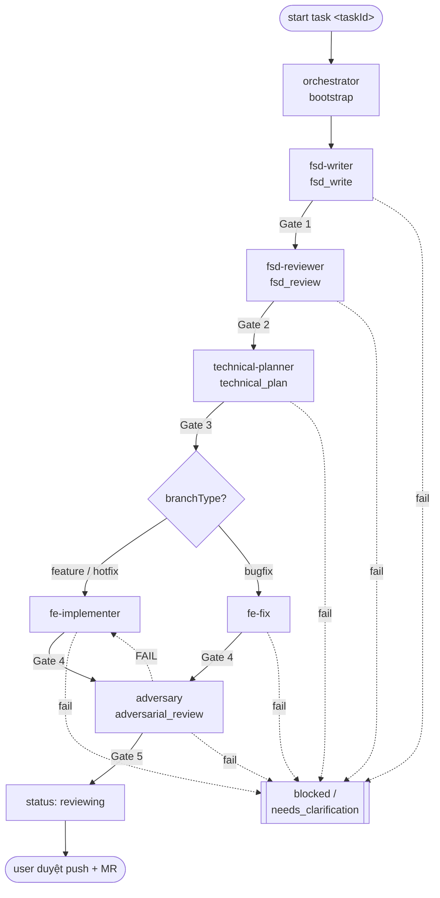

# Agents — Role registry, workflow, gate (nguồn chuẩn duy nhất cho lifecycle)

> **Phạm vi:** tài liệu canonical định nghĩa 7 role, lifecycle qua các stage có gate, cách chọn implementer theo `branchType`, và quy tắc skip. Quy tắc vận hành chi tiết (MCP, guardrail, nhánh, handoff, lệnh, ngân sách token): [`agents/SharedRules.md`](./agents/SharedRules.md) — không lặp lại ở đây.
> **Repo:** khai ở `harness.config.json → repos`. Harness chạy được ở ba bố cục — xem §0.

---

## 0. Bố cục repo

Harness không giả định code nằm ở đâu. `harness.config.json → repos` khai từng repo mà agent được sửa, `path` tính từ thư mục chứa config:

| Bố cục | `repos` | Task docs nằm | Worktree |
| --- | --- | --- | --- |
| **A. Trong repo code** (một repo FE, hoặc một repo BE) | `[{ name, path: ".", layer }]` | **cùng repo** với code | `/start-task` tạo worktree của chính repo đó; task doc đi theo worktree |
| **B. Trong một repo, đọc repo anh em** | `[{ path: "." }, { path: "../<repo>", … }]` | trong repo chính | như A; repo anh em **read-only**, không worktree, không sửa |
| **C. Ngang hàng FE + BE** (harness là repo riêng) | `[{ path: "../fe" }, { path: "../be" }]` | **repo harness**, tách khỏi mọi repo code | worktree tạo **trong repo code** đang sửa (`repoName` của task); task doc ở lại repo harness, **không** vào worktree |

**Quy tắc chung cho cả ba:**

- `repoName` trong `task.agent.json` chỉ một entry của `repos` — đó là repo agent được sửa. Sai tên → validator chặn.
- Repo khai trong `repos` mà **không** phải `repoName` của task: **read-only** (vd đọc DTO của BE — [`agents/TechnicalPlanner.md` §3.2](./agents/TechnicalPlanner.md)). Đọc được, không sửa.
- Repo **không** khai trong `repos`: không đụng tới.
- Subagent **không bao giờ** tự tạo/đổi worktree — nó đã ở đúng chỗ khi được dispatch ([`Instructions.md` §1](./Instructions.md)).
- Bố cục C: commit task doc và commit code là **hai repo khác nhau**, hai lần commit. Gate pass → `reviewing` → user tự quyết commit ở đâu.

Task chạm **nhiều layer** (vd sửa cả FE lẫn BE): tách thành hai task, mỗi task một `repoName`. Một `task.agent.json` chỉ có một `repoName` — cố nhét hai repo vào một task thì AC traceability và scope Gate 3 mất nghĩa.

---

## 1. Bảng role (7 role)

Tên kebab-case; `layer` luôn `frontend`; mỗi role một file trong [`agents/`](./agents/SharedRules.md).

| Role | Stage | Output chính | Gate chặn khi | Chi tiết |
| --- | --- | --- | --- | --- |
| `orchestrator` | bootstrap | task folder, `task.agent.json`, `00-Metadata.md`, `.agent-memory/` | metadata thiếu không suy ra được | [`agents/Orchestrator.md`](./agents/Orchestrator.md) |
| `fsd-writer` | fsd_write | `01-FSD.md` (FSD IEEE cấp task — skill `document-to-ieee-srs`) | FSD chưa đủ / không truy vết được (**Gate 1**) | [`agents/FSDWriter.md`](./agents/FSDWriter.md) |
| `fsd-reviewer` | fsd_review | `02-FSD-Review.md` (AC, câu hỏi BA, risk) | intent / AC chưa rõ (**Gate 2**) | [`agents/FSDReviewer.md`](./agents/FSDReviewer.md) |
| `technical-planner` | technical_plan | `03-Technical-Plan.md` (file sẽ đổi, test plan, checklist, risk) | thiếu plan / test (**Gate 3**) | [`agents/TechnicalPlanner.md`](./agents/TechnicalPlanner.md) |
| `fe-implementer` | implementation (feature/hotfix) | code + `06-FE-Implementation-Notes.md` + `08-Test-Evidence.md` | thiếu evidence / ngoài scope (**Gate 4**) | [`agents/FEImplementer.md`](./agents/FEImplementer.md) |
| `fe-fix` | implementation (bugfix) | như trên, định hướng reproduce-first | như trên (**Gate 4**) | [`agents/FEFix.md`](./agents/FEFix.md) |
| `adversary` | adversarial_review | `09-Adversarial-Review.md` (tự chạy lại lệnh, soi diff + test, finding) | có finding BLOCKING / evidence không tái lập (**Gate 5**) | [`agents/Adversary.md`](./agents/Adversary.md) |

> Task ở layer `frontend` mà repo BE **không** nằm trong `repos`: contract FE↔API chỉ ghi ở **góc nhìn client** trong `03-Technical-Plan.md`. Có repo BE trong `repos` → đọc thẳng source BE (read-only) theo thang bậc [`agents/TechnicalPlanner.md` §3.2](./agents/TechnicalPlanner.md). Thiếu ⇒ `unavailable`, không bịa.

---

## 2. Lifecycle

Gate fail → `status = blocked` / `needs_clarification`, ghi blocker vào doc + `.agent-memory/{role}.md`, **báo to cho user** (4 ý bắt buộc — [`agents/SharedRules.md` §4](./agents/SharedRules.md)), dừng automation tới khi user/BA resolve.

**Cách ly ngữ cảnh per-stage:** mỗi stage chạy như **một subagent riêng** (context mới), nhận đầu vào qua artifact + handoff `.agent-memory/` thay vì qua hội thoại. Main loop chỉ điều phối gate. Chi tiết dispatch: lệnh `/start-task` (`.claude/commands/start-task.md`).

---

## 3. Định nghĩa gate

Gate là điểm kiểm tra **chặn**. PASS mới handoff; FAIL → đặt status, ghi blocker, báo to, dừng.

| Gate | Sau stage | Điều kiện PASS | FAIL → status |
| --- | --- | --- | --- |
| **Gate 1** | fsd_write | `01-FSD.md` đủ khung IEEE (Introduction, Overall Description, External Interface, Functional Requirements); mỗi requirement dùng `shall` + truy vết được (`FR-`/`FSD-`/tracker/design); assumption tách riêng; **≤ 250 dòng** (trần tại [`agents/SharedRules.md` §8](./agents/SharedRules.md)) | `needs_clarification` |
| **Gate 2** | fsd_review | AC + business intent rõ; câu hỏi BA `blocking` đã trả lời; ID `FR-`/`NFR-`/`FSD-` đã trích; **≤ 150 dòng** | `needs_clarification` |
| **Gate 3** | technical_plan | `03-Technical-Plan.md` có: danh sách file FE sẽ đổi, test plan (lệnh one-shot cụ thể), checklist, risk; **mọi AC của `02` có ở cột Covers AC hoặc bảng AC-manual** ([SharedRules §9.1](./agents/SharedRules.md)); **≤ 200 dòng** | `blocked` |
| **Gate 4** | implementation | Bộ lệnh kiểm tra bắt buộc của project PASS ([`agents/ProjectRules.md` §7](./agents/ProjectRules.md)) với evidence thật trong `08-Test-Evidence.md`; **bảng AC coverage đủ mọi AC**, AC bị làm lệch đã có Amendment log ([SharedRules §9](./agents/SharedRules.md)); thay đổi **trong scope** danh sách Gate 3 | `blocked` |

| **Gate 5** | adversarial_review | `adversary` **tự chạy lại** toàn bộ lệnh ProjectRules §7 và khớp với `08`; mọi AC có test thật sự assert được nó; diff nằm trong scope Gate 3 (phần ngoài đã khai Plan Deviations); **không** finding BLOCKING; không còn UNCERTAIN | `blocked` → re-route implementer |

Danh sách lệnh hợp lệ (one-shot vs watch-mode): [`agents/SharedRules.md` §7](./agents/SharedRules.md).

> **Vì sao có Gate 5:** Gate 1–4 đều do chính người làm tự chấm. Validator chỉ đọc được văn bản — nó thấy `08` có lệnh và có chữ "passed", không thấy được test đó có thật sự chứng minh AC. `adversary` mặc định FAIL và phải tự kiếm bằng chứng để PASS.

---

## 4. Chọn implementer theo `branchType`

| branchType | Implementer |
| --- | --- |
| `feature`, `hotfix` | `fe-implementer` |
| `bugfix` | `fe-fix` |

Quy tắc nhánh (tạo từ `develop` với `--ff-only`, ngoại lệ nhánh user quản lý + `branchActual`): [`agents/SharedRules.md` §3](./agents/SharedRules.md).

---

## 5. Quy tắc skip

`taskComplexity ∈ {trivial, normal, high}` (định nghĩa tại [`agents/SharedRules.md` §6](./agents/SharedRules.md)). Khi `taskComplexity = trivial`:

- **`fsd-writer` chạy light:** `01-FSD.md` đủ khung IEEE tối thiểu (Introduction + Functional Requirements có `shall` + trace), rút gọn mục non-functional/data khi task không chạm. Gate 1 vẫn phải PASS.
- **`fsd-reviewer` chạy light:** vẫn trích AC tối thiểu + ID liên quan; bỏ được phân tích risk dài + câu hỏi BA nếu intent đã rõ. Gate 2 vẫn phải PASS.
- `orchestrator`, `technical-planner`, implementer, `adversary` **không** được skip.

---

## 6. Liên kết

- Quy tắc vận hành chi tiết: [`agents/SharedRules.md`](./agents/SharedRules.md) · Global rule: [`Instructions.md`](./Instructions.md)
- Bootstrap & resume: [`HarnessSetup.md`](./HarnessSetup.md) · Chỉ mục: [`README.md`](./README.md)
- Role: [`agents/Orchestrator.md`](./agents/Orchestrator.md) · [`agents/FSDWriter.md`](./agents/FSDWriter.md) · [`agents/FSDReviewer.md`](./agents/FSDReviewer.md) · [`agents/TechnicalPlanner.md`](./agents/TechnicalPlanner.md) · [`agents/FEImplementer.md`](./agents/FEImplementer.md) · [`agents/FEFix.md`](./agents/FEFix.md) · [`agents/Adversary.md`](./agents/Adversary.md)
- Task docs & template: [`tasks/README.md`](./tasks/README.md) · Artifact nguồn: [`srs/`](./srs/README.md) · [`fsd/`](./fsd/README.md) · [`api/`](./api/README.md)
