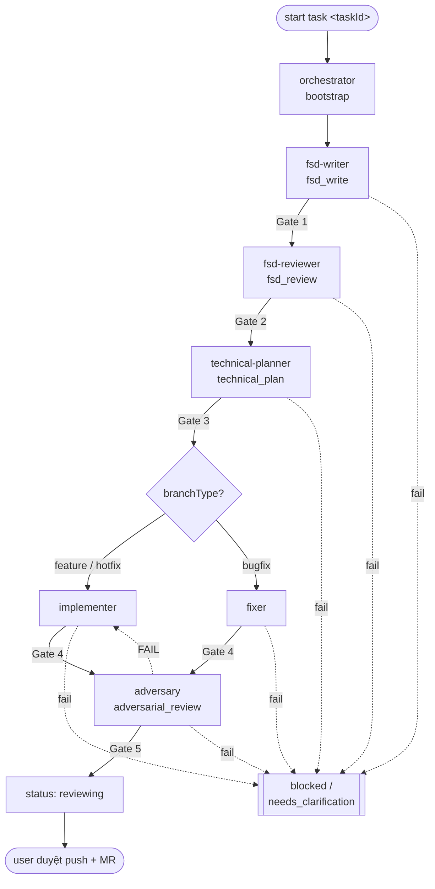

# Agents — Sổ đăng ký role, workflow, gate (nguồn sự thật duy nhất của vòng đời)

> Bản dịch của [`../Agents.md`](../Agents.md). Lệch nhau → bản tiếng Anh thắng.
> **Phạm vi:** tài liệu chuẩn định nghĩa 7 role, vòng đời qua các stage có gate, cách chọn implementer từ `branchType`, và luật rút gọn. Luật vận hành chi tiết (MCP, guardrail, nhánh, handoff, lệnh, token budget): [`agents/SharedRules.md`](./agents/SharedRules.md) — không lặp lại ở đây.
> **Repo:** khai báo trong `harness.config.json → repos`. Harness chạy ở ba bố cục — xem §0.

---

## 0. Bố cục repo

Harness không giả định code nằm ở đâu. `harness.config.json → repos` khai báo từng repo agent được sửa, với `path` tính tương đối so với thư mục chứa config:

| Bố cục | `repos` | Task doc nằm ở | Worktree |
| --- | --- | --- | --- |
| **A. Trong chính repo code** (một repo FE, hoặc một repo BE) | `[{ name, path: ".", layer }]` | **cùng repo** với code | `/start-task` tạo worktree của repo đó; task doc đi theo |
| **B. Trong một repo, đọc các repo anh em** | `[{ path: "." }, { path: "../<repo>", … }]` | ở repo chính | như A; repo anh em là **chỉ đọc**, không worktree, không sửa |
| **C. Nằm cạnh FE + BE** (harness là repo riêng) | `[{ path: "../fe" }, { path: "../be" }]` | ở **repo harness**, tách khỏi mọi repo code | worktree được tạo **bên trong repo code** đang bị sửa (`repoName` của task); task doc ở lại repo harness, **không** vào worktree |

**Luật chung cho cả ba:**

- `repoName` trong `task.agent.json` trỏ đúng một entry của `repos` — repo mà agent được sửa. Tên sai thì validator chặn.
- Repo có khai báo trong `repos` nhưng **không** phải `repoName` của task là **chỉ đọc** (ví dụ đọc DTO của BE — [`agents/TechnicalPlanner.md` §3.2](./agents/TechnicalPlanner.md)). Đọc được, không sửa được.
- Repo **không** khai báo trong `repos`: tuyệt đối không đụng.
- Subagent **không bao giờ** tạo hay đổi worktree — nó đã ở đúng chỗ khi được dispatch ([`Instructions.md` §1](./Instructions.md)).
- Bố cục C: commit task doc và commit code là **hai repo khác nhau**, hai commit. Qua hết gate → `reviewing` → user quyết commit gì ở đâu.

Task đụng **nhiều layer** (ví dụ sửa cả FE lẫn BE): tách thành hai task, mỗi task một `repoName`. Một `task.agent.json` chỉ có đúng một `repoName` — nhồi hai repo vào một task làm cho truy vết AC và phạm vi Gate 3 trở nên vô nghĩa.

---

## 1. Bảng role (7 role)

Tên viết kebab-case; `layer` của task lấy từ `repos[].layer`; mỗi role có một file trong [`agents/`](./agents/SharedRules.md).

| Role | Stage | Output chính | Gate chặn khi | Chi tiết |
| --- | --- | --- | --- | --- |
| `orchestrator` | bootstrap | thư mục task, `task.agent.json`, `00-Metadata.md`, `.agent-memory/` | thiếu metadata bắt buộc và không suy ra được | [`agents/Orchestrator.md`](./agents/Orchestrator.md) |
| `fsd-writer` | fsd_write | `01-FSD.md` (FSD IEEE cấp task — skill `document-to-ieee-srs`) | FSD thiếu / không truy vết được (**Gate 1**) | [`agents/FSDWriter.md`](./agents/FSDWriter.md) |
| `fsd-reviewer` | fsd_review | `02-FSD-Review.md` (AC, câu hỏi BA, rủi ro) | ý định / AC chưa rõ (**Gate 2**) | [`agents/FSDReviewer.md`](./agents/FSDReviewer.md) |
| `technical-planner` | technical_plan | `03-Technical-Plan.md` (file cần sửa, test plan, checklist, rủi ro) | thiếu plan / test (**Gate 3**) | [`agents/TechnicalPlanner.md`](./agents/TechnicalPlanner.md) |
| `implementer` | implementation (feature/hotfix) | code + `06-Implementation-Notes.md` + `08-Test-Evidence.md` | thiếu bằng chứng / ngoài phạm vi (**Gate 4**) | [`agents/Implementer.md`](./agents/Implementer.md) |
| `fixer` | implementation (bugfix) | như trên, nhưng theo hướng reproduce-first | như trên (**Gate 4**) | [`agents/Fixer.md`](./agents/Fixer.md) |
| `adversary` | adversarial_review | `09-Adversarial-Review.md` (chạy lại lệnh, soi diff + test, findings) | có finding BLOCKING / bằng chứng không tái lập được (**Gate 5**) | [`agents/Adversary.md`](./agents/Adversary.md) |

> Khi task ở một layer còn repo của layer đối diện **không** nằm trong `repos`: ghi hợp đồng **chỉ từ góc nhìn bên gọi** vào `03-Technical-Plan.md`. Khi repo đó *có* trong `repos` → đọc thẳng source (chỉ đọc) theo thang bậc ở [`agents/TechnicalPlanner.md` §3.2](./agents/TechnicalPlanner.md). Thiếu ⇒ `unavailable`, không bao giờ bịa.

---

## 2. Vòng đời



Gate fail → `status = blocked` / `needs_clarification`, ghi blocker vào doc + `.agent-memory/{role}.md`, **báo user thật to** (bốn điểm bắt buộc — [`agents/SharedRules.md` §4](./agents/SharedRules.md)), và dừng automation cho tới khi user/BA gỡ.

**Cô lập context theo stage:** mỗi stage chạy như **subagent riêng** (context mới), nhận input qua artifact + handoff `.agent-memory/` chứ không qua hội thoại. Vòng lặp chính chỉ điều phối gate. Chi tiết dispatch: lệnh `/start-task` (`.claude/commands/start-task.md`).

---

## 3. Định nghĩa gate

Gate là chốt kiểm **chặn**. Chỉ bàn giao khi PASS; khi FAIL thì đặt status, ghi blocker, báo to, dừng.

| Gate | Sau stage | Điều kiện PASS | FAIL → status |
| --- | --- | --- | --- |
| **Gate 1** | fsd_write | `01-FSD.md` có đủ bộ khung IEEE (Introduction, Overall Description, External Interface, Functional Requirements); mọi requirement dùng `shall` và truy vết được (`FR-`/`FSD-`/tracker/design); assumption để riêng; **≤ 250 dòng** (giới hạn ở [`agents/SharedRules.md` §8](./agents/SharedRules.md)) | `needs_clarification` |
| **Gate 2** | fsd_review | AC + ý định nghiệp vụ rõ; câu hỏi BA `blocking` đã được trả lời; có trích ID `FR-`/`NFR-`/`FSD-`; **≤ 150 dòng** | `needs_clarification` |
| **Gate 3** | technical_plan | `03-Technical-Plan.md` có: file cần sửa, test plan (lệnh one-shot cụ thể), checklist, rủi ro; **mọi AC từ `02` xuất hiện ở cột Covers AC hoặc bảng AC-manual** ([SharedRules §9.1](./agents/SharedRules.md)); **≤ 200 dòng** | `blocked` |
| **Gate 4** | implementation | Các lệnh kiểm bắt buộc của project PASS ([`../agents/ProjectRules.md` §7](../agents/ProjectRules.md)) với bằng chứng thật trong `08-Test-Evidence.md`; **bảng AC coverage phủ hết mọi AC**, và AC nào làm lệch đi thì phải có dòng Amendment log ([SharedRules §9](./agents/SharedRules.md)); thay đổi nằm **trong phạm vi** danh sách Gate 3 | `blocked` |
| **Gate 5** | adversarial_review | `adversary` **chạy lại** mọi lệnh ProjectRules §7 và đối chiếu với `08`; mọi AC có test thực sự assert nó; diff nằm trong phạm vi Gate 3 (ngoài phạm vi thì phải khai dưới Plan Deviations); **không** có finding BLOCKING; không còn UNCERTAIN | `blocked` → đẩy lại cho implementer |

Danh sách lệnh hợp lệ (one-shot vs watch mode): [`agents/SharedRules.md` §7](./agents/SharedRules.md).

> **Vì sao có Gate 5:** Gate 1–4 đều do chính người làm tự chấm. Validator chỉ đọc được chữ — nó thấy `08` có một lệnh và chữ "passed", nó không thấy được test đó có thật sự chứng minh AC hay không. `adversary` bắt đầu ở trạng thái FAIL và phải tìm ra bằng chứng mới lên được PASS.

---

## 4. Chọn implementer từ `branchType`

| branchType | Implementer |
| --- | --- |
| `feature`, `hotfix` | `implementer` |
| `bugfix` | `fixer` |

Luật nhánh (tạo từ `develop` bằng `--ff-only`, ngoại lệ nhánh do user quản + `branchActual`): [`agents/SharedRules.md` §3](./agents/SharedRules.md).

---

## 5. Chấm độ phức tạp → chọn độ nặng workflow & model

`taskComplexity` quyết định **hai** thứ: Gate 1/2 chạy đầy đủ hay rút gọn, và role nào đáng dùng model đắt. Đoán thấp thì gate thành nghi lễ; đoán cao thì đốt tiền cho một sửa CSS một dòng.

### 5.1. Chấm điểm — LLM trích xuất, công thức tính

**Agent không được tuyên bố "task này 7/10".** Con số đó không kiểm lại được và không debug được. Agent chỉ **trích xuất từng chiều**; điểm và phân loại do **công thức** ra. Vector lưu ở `task.agent.json → complexity`, và validator kiểm tra công thức có khớp phân loại không.

**Sáu chiều công sức**, mỗi chiều `0` (không) · `1` (có ít) · `2` (nhiều):

| Chiều | `0` | `1` | `2` |
| --- | --- | --- | --- |
| `scope` | 1 file | vài file, một module | nhiều module / nhiều layer |
| `uncertainty` | yêu cầu đã rõ hết | vài chỗ phải suy ra | không hỏi BA thì không làm được |
| `dependency` | không có | một module sẵn có | service/repo khác |
| `dataImpact` | không đụng dữ liệu | đọc/ghi qua API sẵn có | đổi schema · migration · đổi shape dùng chung |
| `integration` | không có | gọi API sẵn có | hợp đồng mới/đổi · hệ thống ngoài |
| `testing` | test sẵn có đã phủ | test mới bình thường | khó tái lập · cần e2e/thủ công |

`effort = tổng` (0–12).

**Chấm từ đo đạc, không chấm từ mô tả task.** Mô tả task là thứ dễ thiếu nhất, và vector chấm từ nó là cách rẻ nhất để đánh giá thấp — mà đánh giá thấp thì sinh retry, và retry đắt hơn mọi quyết định về model cộng lại. Nên ba chiều đo được phải kèm số, ghi vào `complexity.counts` / `complexity.questions`:

| Chiều | Chạy | Ràng buộc validator áp |
| --- | --- | --- |
| `scope` | `rg -l '<symbol chính>' <src> \| wc -l` → `counts.symbol` + `counts.filesTouched` | `1` ⇒ `scope 0` · `2–5` ⇒ `scope ≥ 1` · `>5` ⇒ `scope 2` · `0` ⇒ bắt buộc có `note`. `counts.symbol` phải grep được (≥3 ký tự, không khoảng trắng) |
| `testing` | đếm số file test phủ code đó → `counts.existingTests` | `0` ⇒ `testing ≥ 1` |
| `uncertainty` | viết ra danh sách "không biết X thì không làm tiếp được" → `questions[]` | rỗng ⇒ `uncertainty 0` · không rỗng ⇒ `uncertainty ≥ 1`. Mục dưới 10 ký tự không tính — `[""]` từng được dùng để thoả "không rỗng" mà chẳng nói gì |

**`counts.symbol` là bắt buộc** vì chọn symbol chính là chọn luôn kết quả: grep một helper hiếm thì ra 1 file (`scope 0`); grep một symbol phổ biến thì ra 20 (`scope 2`) — cho cùng một task. Ghi symbol lại không xoá được lựa chọn đó, nhưng làm nó **hiện ra** lúc review. `filesTouched: 0` (không khớp gì) nằm ngoài mọi luật trên — file hoàn toàn mới và grep trượt là hai chuyện rất khác nhau mà con số không phân biệt được, nên `note` phải nói rõ là cái nào.

Ba chiều còn lại (`dependency`, `dataImpact`, `integration`) không có phép đếm nào nói được điều gì đúng, nên chúng ở lại dạng phán đoán — nhưng `note` nên nêu đích danh file/hợp đồng đã xem.

`uncertainty` là chiều hay bị chấm thấp nhất và đắt nhất: nó chính là thứ sinh ra `fsd_review ≥ 2`. Luật: **chưa viết danh sách câu hỏi thì chưa được chấm `uncertainty: 0`** — "rỗng" phải là kết luận sau khi tìm, không phải giá trị mặc định.

**Hai chiều rủi ro**, để riêng vì chúng **không đi theo kích thước**:

| Chiều | Ý nghĩa | Thang |
| --- | --- | --- |
| `blastRadius` | hỏng thì lan xa đến đâu | `0` một chỗ · `1` một module · `2` một feature · `3` một service · `4` toàn hệ thống |
| `reversibility` | rollback khó đến đâu | `0` sửa lại là xong · `1` revert một commit · `2` phải deploy lại · `3` phải vá dữ liệu · `4` không thể đảo (migration drop cột, tiền đã chuyển) |

> **Hai chiều này không đo được, và chúng mạnh nhất.** Riêng `riskFloor` đã kéo `trivial → high`, nên chấm `blastRadius: 1` thay vì `3` là né sạch mọi sự nghiêm ngặt của ba chiều có `counts`. Đừng bịa ra một phép đếm giả ở đây — không phép đếm nào đúng cả. Chỗ bắt được chuyện này là §5.6: `escapedBugs > 0` từ một task `trivial` chính là tín hiệu hai chiều này đang bị chấm thấp một cách hệ thống.

**Hai luật nhất quán vẫn được áp**, vì chúng không phải phép đo — chúng là số học trên các chiều công sức bạn đã chấm từ bằng chứng. `dataImpact: 2` mà bảo revert một commit là xong, hay một hợp đồng ngoài mới mà bảo hỏng chỉ ảnh hưởng một chỗ, không phải phán đoán mà là mâu thuẫn:

| Luật | Vì sao |
| --- | --- |
| `dataImpact = 2` ⇒ `reversibility ≥ 2` | đổi schema/migration không sửa lại file là xong |
| `integration = 2` ⇒ `blastRadius ≥ 1` | hợp đồng mới/đổi hoặc hệ thống ngoài, theo định nghĩa, vượt khỏi một chỗ |

### 5.1.1. Công thức (tất định — không phải LLM quyết)

```
effort = scope + uncertainty + dependency + dataImpact + integration + testing   # 0–12

base        = trivial khi effort ≤ 2 · normal khi effort ≤ 6 · high khi effort ≥ 7
riskFloor   = high     khi blastRadius ≥ 3  hoặc reversibility ≥ 3
            = normal   khi blastRadius ≥ 2  hoặc reversibility ≥ 2
            = trivial  còn lại

taskComplexity = max(base, riskFloor)          # trivial < normal < high
```

`riskFloor` là lý do một bug race-condition websocket không rơi vào `trivial`: `effort` có thể là 2 (sửa một file) nhưng `blastRadius = 3` nâng nó lên `high`. Ngược lại, sửa copy ở 12 file là `effort` cao với `blastRadius = 0` — vẫn chỉ `normal`, không đáng dùng model đắt.

### 5.1.2. Cái gì đi vào `task.agent.json`

```json
"complexity": {
  "vector": { "scope": 2, "uncertainty": 1, "dependency": 2, "dataImpact": 2,
              "integration": 1, "testing": 2, "blastRadius": 2, "reversibility": 1 },
  "effort": 10,
  "counts": { "symbol": "useEmployeeResolver", "filesTouched": 9, "existingTests": 0 },
  "questions": ["nhân viên bị gỡ khỏi phòng ban thì những vai trò nào nhận thông báo?"],
  "splitEvaluated": "tách thành ABC-12 (resolver) + ABC-13 (notification) — ship riêng được",
  "assessedAt": "bootstrap",
  "note": "đụng resolver nhân viên + notification; test cần mock queue"
}
```

`counts` và `questions` **không phải lời bình** — validator đối chiếu chúng với vector và chặn khi mâu thuẫn (`filesTouched: 1` với `scope: 1`, `questions` rỗng với `uncertainty: 2`, …). Bỏ trống cũng là lỗi với task tạo sau `acTrace.since`; task cũ hơn thì chỉ cảnh báo.

Tương tự với câu trả lời có mà như không: `counts.symbol: "s"`, `questions: [""]`, `splitEvaluated: "n/a"`. Để trống vốn đã là lỗi, nên viết hai chữ cho qua là lối thoát còn lại; giờ nó cũng bị chặn — §5.1.4 muốn câu hỏi tách task được **trả lời**, không phải bị đóng lại.

**`createdAt` được đối chiếu với git.** Nó là công tắc quyết định cả mục này là lỗi hay cảnh báo (`acTrace.since`), và pre-commit chạy `--no-warn` — nên một chuỗi tự khai đã tắt được nhiều luật hơn bất kỳ field nào khác. Nó phải ở dạng `YYYY-MM-DD`, và một ngày tự nhận là có trước harness sẽ bị commit đầu tiên của thư mục phản chứng: không có lịch sử, hoặc commit đầu tiên sau mốc, nghĩa là task được tạo dưới harness và §5.1/§5.6 áp đầy đủ. Không có git → không có nhân chứng, không có finding.

**Thiếu khối `complexity` là lỗi, không phải cảnh báo** (với task tạo sau `acTrace.since`). Trước đây nó là cảnh báo, mà pre-commit chạy `--no-warn` — nghĩa là **xoá khối đó rẻ hơn điền sai**, biến cả §5.1 thành tuỳ chọn. Mọi quyết định routing phía sau (độ nặng gate, hạng model, worktree) đều dựa trên vector này.

`taskComplexity` (field cũ) vẫn là cách đọc nhanh; `complexity.vector` là **cơ sở** của nó. Validator tính lại công thức từ vector — lệch với `taskComplexity` là **lỗi**. Đó là chỗ chữ "tất định" có răng: agent không thể ghi vector thấp rồi tuyên bố `high`, hay ngược lại.

### 5.1.3. Chấm lại sau khi khảo sát

Đánh giá lúc bootstrap dựa trên mô tả task, mà mô tả task thì hay thiếu. Khi `technical-planner` đã khảo sát `src/`, nó **bắt buộc** kiểm lại vector:

- Vector cũ vẫn đúng → không làm gì.
- Rộng hơn đáng kể (thêm một tầng dependency, một migration, một hợp đồng thay đổi) → **cập nhật vector**, ghi `assessedAt: "technical_plan"` + lý do, tính lại `taskComplexity`.

Dù thế nào cũng đặt `assessedAt: "technical_plan"`. Khi vector không đổi thì field đó là **dấu vết duy nhất** cho thấy đã kiểm lại — thiếu nó thì đúng cái stage dễ phát hiện task rộng hơn quảng cáo lại cũng là stage không ai biết đã bị bỏ qua. Vẫn còn `"bootstrap"` sau khi qua `technical_plan` → cảnh báo.

Chỉ được **nâng**. Hạ xuống để chạy nhẹ hơn là né gate — muốn hạ thì chuyển `needs_clarification` và hỏi user.

**Luật này có răng.** Validator so vector đã lưu với vector ghi trong `_triage.log`, **theo cả hai chiều**:

Phép so dùng giá trị **thấp nhất** từng nhập cho mỗi chiều, không phải giá trị mới nhất. "Lần cuối thắng" chính là trao lại đúng chiêu né mà cái log này sinh ra để bắt: chấm thấp, lấy `quick-task`, rồi chạy lại `--triage` với vector thật và phép so sẽ so vector đã lưu với chính nó. Task **không có** entry nào cũng là cảnh báo — `_triage.log` không được track, nên xoá nó từng xoá luôn phép so trong im lặng.

| Chiều | Mức | Vì sao |
| --- | --- | --- |
| cao hơn lúc triage | cảnh báo | bình thường — khảo sát thấy nhiều hơn Glob/Grep. Chỉ là lời nhắc: con số thấp hơn mới là con số quyết định task này có cần harness hay không |
| **thấp hơn** lúc triage | **lỗi** | đây là chiều bị cấm: hạ một chiều mua được gate nhẹ hơn và hạng model rẻ hơn mà không mất gì |

Vector tăng lên `high` sau khảo sát → các stage sau dùng cột `high` (§5.3), và nếu `blastRadius ≥ 3` thì planner phải nêu dưới Risk để user biết trước khi implementer chạy.

### 5.1.4. Tách task **trước khi** đốt ngân sách

Đòn bẩy chi phí lớn nhất không phải chọn model — mà là một task quá to. So thẳng:

| | 1 task `high` | 2 task `normal` |
| --- | --- | --- |
| Stage | 7 × hạng `strong` ở 3 role | 14 × hạng `mid` |
| Gate 1/2 | đầy đủ + soi kỹ | có thể rút gọn |
| Retry | nhiều khả năng (spec rộng, plan dễ sai) | mỗi task hẹp, ít bật lại |

Gấp đôi số stage, nhưng hạng rẻ hơn và ít làm lại — tổng thường **rẻ hơn**, và khoản tiết kiệm rõ nhất là phần làm lại.

`status = split` (§5.5) đã có sẵn, nhưng nó là cửa thoát khi `retryBudget` **cạn** — lúc đó tiền đã tiêu rồi. Nên còn một chốt ở bootstrap:

> `effort ≥ splitEffort` (mặc định `9`), **hoặc** `scope = 2` đi kèm `uncertainty = 2` → bắt buộc điền `complexity.splitEvaluated`.

Hai giá trị hợp lệ: danh sách taskId con (đã tách), hoặc lý do không tách được ("một migration, một lần deploy — không ship riêng được"). Validator chặn giá trị rỗng. Nó không ép tách — nó ép **trả lời câu hỏi tách** khi câu trả lời còn rẻ.

`scope 2 + uncertainty 2` đủ điều kiện ngay cả khi `effort` dưới 9 vì đó là tổ hợp tệ nhất: vừa rộng **vừa** mù. Những task như vậy gần như luôn bật lại ở `fsd_review` rồi bật lại lần nữa ở `implementation`.

### 5.2. Độ nặng workflow

Không mức nào được bỏ stage hay bỏ gate. `trivial` chỉ làm Gate 1/2 **ngắn hơn**:

| | `trivial` | `normal` | `high` |
| --- | --- | --- | --- |
| `fsd-writer` | khung IEEE tối thiểu: Introduction + Functional Requirements với `shall` + một trace. Rút gọn phần phi chức năng/dữ liệu khi task không đụng tới | đầy đủ | đầy đủ + soi kỹ ràng buộc & dependency |
| `fsd-reviewer` | AC tối thiểu + các ID liên quan; bỏ được phần rủi ro dài/câu hỏi BA khi ý định đã rõ | đầy đủ | thêm phân tích rủi ro + đối chiếu chéo spec |
| `technical-planner` · implementer · `adversary` | **không bao giờ** rút gọn | **không bao giờ** rút gọn | **không bao giờ** rút gọn |

Gate 1 và 2 vẫn phải PASS ở cả ba mức.

### 5.3. Chọn model theo **hạng**, không theo tên nhà cung cấp

Kernel không biết bạn chạy Claude Code, Codex hay CLI khác — nên nó chỉ gọi tên **ba hạng**. Ánh xạ hạng → model thật nằm ở `harness.config.json → models`:

```json
"models": { "cheap": "haiku", "mid": "sonnet", "strong": "opus" }
```

Đổi CLI nghĩa là sửa đúng ba dòng đó (`gpt-5-mini` / `gpt-5` / `gpt-5-pro`, `gemini-flash` / `gemini-pro` / …). Bảng dưới không đổi. Để `models` là `{}` nghĩa là dùng mặc định của CLI và không route gì cả.

Nguyên tắc: **hạng rẻ cho việc đọc-và-chép, hạng mạnh cho việc phán đoán.** Stage nào sai thì mọi thứ phía sau sai theo — đó là chỗ đáng trả tiền.

| Role | trivial | normal | high | Vì sao |
| --- | --- | --- | --- | --- |
| `orchestrator` | cheap | cheap | mid | đọc tracker, điền template — ít phán đoán |
| `fsd-writer` | cheap | mid | mid | biến mô tả thành requirement có cấu trúc |
| `fsd-reviewer` | mid | mid | strong | **một AC sai ở đây làm sai mọi stage sau** |
| `technical-planner` | mid | mid | strong | chọn sai chỗ sửa → implementer làm lại từ đầu |
| `implementer` / `fixer` | mid | mid | strong | viết code thật |
| `adversary` | mid | mid | strong | phải tìm ra cái implementer bỏ sót — cùng hạng thì cùng điểm mù |

**Vì sao `adversary` không bao giờ bị hạ xuống cheap:** role này tồn tại để nhìn ra cái người làm không nhìn ra. Ở hạng yếu hơn implementer, nó chỉ gật theo.

**Áp dụng thế nào:** các file `.claude/agents/{role}.md` **không** ghi `model:` — mặc định là model của phiên. `/start-task` tra bảng trên cộng `config.models` rồi truyền `model` lúc dispatch. Nếu CLI không hỗ trợ chọn model theo subagent → bỏ qua; mọi stage chạy model của phiên, harness vẫn chạy, chỉ là không tiết kiệm được gì.

**Đừng tối ưu ngược:** hạ hạng của `fsd-reviewer`/`adversary` để tiết kiệm là mua rủi ro — một AC bị rơi hay một bug lọt lưới đắt hơn toàn bộ tiền model của task.

### 5.4. Hai chiều rủi ro ngoài chuyện chọn model

`blastRadius` và `reversibility` không chỉ nâng `taskComplexity`. Chúng còn quyết định **chỗ dừng lại hỏi người**:

| Điều kiện | Harness làm gì |
| --- | --- |
| `reversibility ≥ 3` (phải vá dữ liệu, hoặc không đảo được) | `technical-planner` phải nêu thành Risk kèm **kế hoạch rollback**; không có kế hoạch → `needs_clarification`, hỏi user trước khi implementer chạy |
| `blastRadius ≥ 3` (từ một service trở lên) | `adversary` **không được** kết luận PASS chỉ dựa trên test trong phạm vi task — phải kiểm các đường lân cận, hoặc nêu rõ giới hạn trong `09` |
| `uncertainty = 2` (phải hỏi BA) | Gate 2 đã chặn sẵn: câu hỏi `blocking` còn `open` thì không qua được (§3) |

Đây là chỗ vector hơn một con số: *"ít code, nhưng không có đường lùi"* là tình huống có thật, và số "42" không nói được điều đó.

### 5.5. Đo sau khi làm: `attempts`

Vector là ước lượng **trước**. Thứ duy nhất đo được **sau** là task phải làm lại bao nhiêu lần.

`task.agent.json → attempts` đếm mỗi stage thực sự chạy mấy lần. Tối ưu là `1`. Mỗi lần bật lại là `+1`:

```json
"attempts": { "fsd_write": 1, "fsd_review": 2, "technical_plan": 1, "implementation": 2 }
```

Đọc theo cặp — chỗ bật lại cho biết cái gì thực sự hỏng:

| Tín hiệu | Ý nghĩa |
| --- | --- |
| `fsd_review` ≥ 2 | FSD thiếu, hoặc yêu cầu vốn đã mơ hồ từ đầu — `uncertainty` bị chấm thấp hơn thực tế |
| `technical_plan` ≥ 2 | AC chưa đủ rõ để lập kế hoạch; Gate 2 cho qua quá dễ |
| `implementation` ≥ 2 | plan trỏ sai chỗ, hoặc phạm vi Gate 3 thiếu |
| `adversarial_review` ≥ 2 | vòng bằng chứng đầu không tái lập được — đúng việc của Gate 5 |

`attempts` ≥ 3 ở một stage → validator cảnh báo. Không phải lỗi (có task thật sự khó), nhưng là tín hiệu đáng đọc khi tinh chỉnh prompt hay quyết định tách task.

**Ngân sách retry có răng — và không tin lời của coordinator.** `attempts` do coordinator ghi, mà coordinator chính là kẻ đang lặp; chẳng ai tự ghi `attempts: 7` để tự tố mình. Nên validator đếm **khối handoff** trong `.agent-memory/{role}.md` — chỉ-append (SharedRules §4), và role không xoá được:

| Điều kiện | Mức |
| --- | --- |
| nhiều khối hơn `attempts[stage]` đã khai | **cảnh báo** — đang khai thiếu phần làm lại |
| số khối ≥ `retryBudget` (mặc định 4) | **lỗi** — hết ngân sách; tách task hoặc sửa spec, đừng retry nữa |

Đây là chỗ duy nhất harness đo được phần làm lại độc lập với thứ nó được kể. `retryBudget` khai trong `harness.config.json`.

**Hết ngân sách thì đi đâu: `status = split`.** "Tách task" cần có cách để nói ra — nếu không, task kẹt cứng: doc chỉ-append nên không gỡ được khối, hạ `attempts` là khai man (validator so với số khối), còn `done` thì đòi bằng chứng Gate 4/5 vốn không tồn tại. Mọi commit đụng tới nó đều đỏ, và một gate mà lối thoát duy nhất còn lại là `--no-verify` là một gate sắp chết.

| Điều kiện | Mức |
| --- | --- |
| `status = split` + `splitInto` với ≥2 taskId | ngân sách hạ xuống **cảnh báo** — giữ lại làm lịch sử |
| `status = split` không có `splitInto` (hoặc chỉ có một) | **lỗi** — "split" mà không tách là đổi tên của bỏ cuộc |

`split` không nằm trong `gate4Statuses`, nên không đòi bằng chứng — nó chưa từng ship. Đây là cửa thoát **có tên và để lại dấu vết**, không phải cửa sau: `--calibrate` đếm task `split` như tín hiệu `scope` đang bị chấm thấp lúc bootstrap.

**Rò rỉ context — luật `/clear` giờ có phép đo.** Mỗi stage chỉ đọc artifact **của nó** (`03` đọc `02`, không đọc `01`), nên `telemetry[].inputTokens` phải **dao động quanh một mức**. Không clear context thì lịch sử hội thoại tích lại — tăng đơn điệu, stage sau lớn hơn stage trước. ≥4 lần dispatch tăng đơn điệu với lần cuối ≥ 2.5× lần đầu → **cảnh báo**.

Cảnh báo chứ không phải lỗi: một task thực sự khó cũng có thể phình, và `08` dán output máy thì to là hợp lệ. Chuỗi dao động — dù lớn — không bị gắn cờ. Nếu CLI không báo token thì im lặng, không đoán.

**Dùng nó để sửa vector, đừng để đó.** Nếu mọi task đều hiện `implementation: 2` thì hoặc `scope` đang bị chấm thấp, hoặc Gate 3 liệt kê thiếu file. Đó là dữ liệu thật để hiệu chỉnh §5.1, thay vì đoán trọng số.

### 5.6. Khép vòng: `outcome` + `--calibrate`

`vector` là ước lượng **trước**, `attempts` là phần làm lại **trong lúc làm**. Cả hai đều không biết task có trụ được sau khi ship hay không. Đó là `outcome`, điền khi đóng task:

```json
"outcome": {
  "escapedBugs": 1,
  "reworkAfterReview": 0,
  "closedAt": "2026-09-10",
  "note": "AC-03 bỏ sót trường hợp user không thuộc phòng ban nào"
}
```

- `escapedBugs` — bug phát hiện **sau** khi task rời harness (QC, staging, production). `> 0` nghĩa là có gate cho lọt thứ lẽ ra phải chặn.
- `reworkAfterReview` — task quay lại sửa code mấy lần sau khi đã `reviewing`.
- `note` — một dòng: ước lượng đã bỏ sót cái gì.

Để trống thì harness chẳng học được gì. Đây là điểm duy nhất bắt buộc có người gõ vào, và cũng là điểm bỏ qua thì đắt nhất — nên `status = done` mà không có `closedAt` là **lỗi**, không phải cảnh báo. (Nếu là cảnh báo thì `--no-warn` của pre-commit sẽ không bao giờ chặn, và vòng học chết trong khi mọi gate vẫn xanh.) Task tạo **trước** `acTrace.since` vẫn chỉ là cảnh báo — chúng có trước harness.

`--calibrate` in **độ phủ** ở dòng đầu (`outcome coverage: 12/20`). Dưới 80%, các finding bên dưới dựa trên mẫu thủng — đừng chỉnh ngưỡng từ đó.

`telemetry` (coordinator ghi ở mỗi lần dispatch: stage · hạng · model · mốc thời gian) là **nửa còn lại** của câu hỏi ROI. `outcome` nói task có trụ được không; `telemetry` nói nó tốn bao nhiêu. Thiếu nó thì §5.3 ("hạng strong đáng tiền") là niềm tin không ai kiểm được. Không ghi token/usage — đó là dữ liệu của nhà cung cấp; tên model + đồng hồ treo tường là đủ.

**Đọc lại định kỳ** (cuối sprint, hoặc mỗi ~20 task):

```bash
node scripts/validate-tasks.mjs --calibrate
```

Nó so ước lượng với kết quả và chỉ ra ngưỡng nào đang sai:

```
trivial  n=1  escaped=1  rework=0  stage-retries=1
normal   n=3  escaped=0  rework=1  stage-retries=3

findings:
• 75% of closed tasks retried "implementation" (4 extra runs) — "scope" is likely scored too low at bootstrap
• 1 bug(s) escaped from "trivial" tasks — the riskFloor thresholds (§5.1.1) are letting real risk through
```

**Nó in bằng chứng; nó không tự sửa ngưỡng.** Luật mà harness âm thầm viết lại là luật không ai review — và các ngưỡng ở §5.1.1 quyết định model, độ nặng gate và worktree. Người đọc finding rồi sửa §5.1.1 trong một commit, có ghi lý do. Đó là vòng khép kín, không phải tự động mù.

Ba cách sửa hay gặp:

| Finding | Sửa gì |
| --- | --- |
| một stage cứ bị chạy lại | chiều tương ứng bị chấm thấp — làm sắc lại **mô tả thang** ở §5.1, không sửa công thức |
| bug lọt từ task `trivial` | ngưỡng `riskFloor` quá lỏng — hạ mốc `blastRadius`/`reversibility` ở §5.1.1 |
| nhiều `high` mà không làm lại và không có bug lọt | ngưỡng `high` kích hoạt quá dễ — đang trả tiền cho model mạnh mà không mua được gì |
| `strong-runs` cao với escaped=0, rework=0 | vẫn chuyện đó nhưng **đã đo được**: hạng strong chạy liên tục mà không mua được gì — hạ hạng các stage ít phán đoán trước, không bao giờ hạ `fsd-reviewer`/`adversary` |

> Finding chỉ xuất hiện từ **5 task đã đóng** trở lên. Một task khó bất thường không phải xu hướng, và một khuyến nghị nghe rất chắc chắn dựa trên n=1 sẽ dẫn tới chỉnh nhầm ngưỡng.

---

## 6. Liên kết

- Luật vận hành chi tiết: [`agents/SharedRules.md`](./agents/SharedRules.md) · Luật toàn cục: [`Instructions.md`](./Instructions.md)
- Bootstrap & resume: [`HarnessSetup.md`](./HarnessSetup.md) · Mục lục: [`README.md`](./README.md)
- Role: [`agents/Orchestrator.md`](./agents/Orchestrator.md) · [`agents/FSDWriter.md`](./agents/FSDWriter.md) · [`agents/FSDReviewer.md`](./agents/FSDReviewer.md) · [`agents/TechnicalPlanner.md`](./agents/TechnicalPlanner.md) · [`agents/Implementer.md`](./agents/Implementer.md) · [`agents/Fixer.md`](./agents/Fixer.md) · [`agents/Adversary.md`](./agents/Adversary.md)
- Task doc & template: [`tasks/README.md`](./tasks/README.md) · Artifact nguồn: [`srs/`](./srs/README.md) · [`fsd/`](./fsd/README.md) · [`api/`](./api/README.md)
